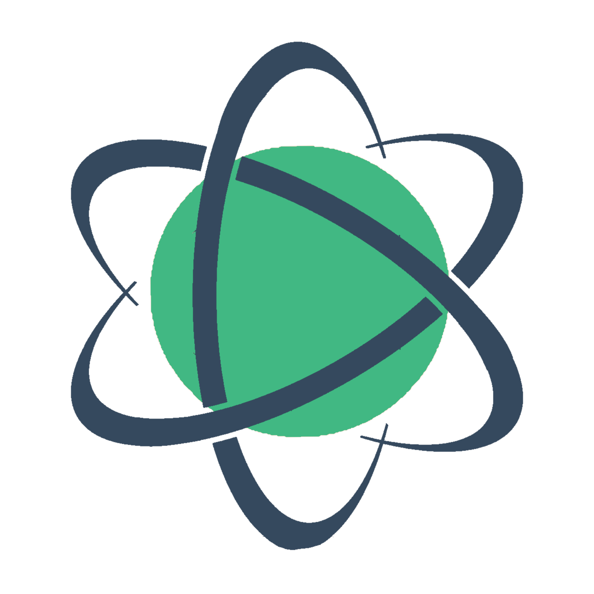
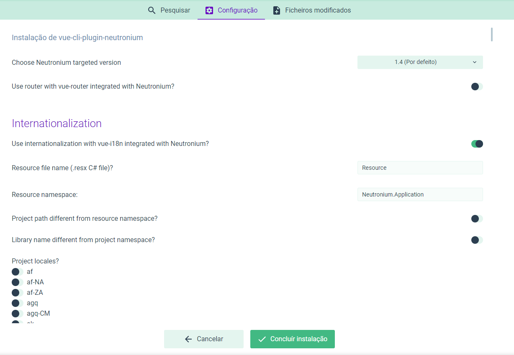

<p align="center"></p>

# vue-cli-plugin-neutronium

[ ](https://www.npmjs.com/package/vue-cli-plugin-neutronium)
[](https://github.com/vuejs/vue-cli)
[](https://github.com/NeutroniumCore/vue-cli-plugin-neutronium/blob/master/LICENSE)


[Vue-cli 3](https://cli.vuejs.org/) plugin to generate a vue [neutronium](https://github.com/NeutroniumCore/Neutronium) project allowing development in the browser, using live-reload on a C# application, and build to neutronium compatible scripts.



## Options:

- Neutronium version:
  - Option 1.3 and 1.4 (default)

   - **Important:** for version superior to 1.4 local files should be referenced using the [pack uri syntax](https://github.com/NeutroniumCore/Neutronium/blob/master/Documentation/Content/Reference_Files.md).

- Use vue router:
  - default: false
  - configure [vue-router](https://router.vuejs.org/) integrated with ViewModel using [ViewModel.Tools ApplicationViewModel](https://github.com/NeutroniumCore/ViewModel.Tools)

- Use internalization:
  - default: false
  - convert .Net .resx file into json files and configure [vue-i18n](https://kazupon.github.io/vue-i18n/) to use them
  - Addition information needed for this option:
    - Resource file name
    - Project namespace
    - Path to C# project (default to namespace)
    - library name (default to namespace)
    - locales to be used


## Scripts
``` sh
npm run serve
```

Debug application in the browser.

``` sh
npm run live
```

Serve the page for live-reload mode of Neutronium application.

``` sh
npm run build
```

Build the application.

## Configuration


## Installing in an Already Created Project

``` sh
vue add neutronium
```

## Injected webpack-chain Rules
No Changes are performed
